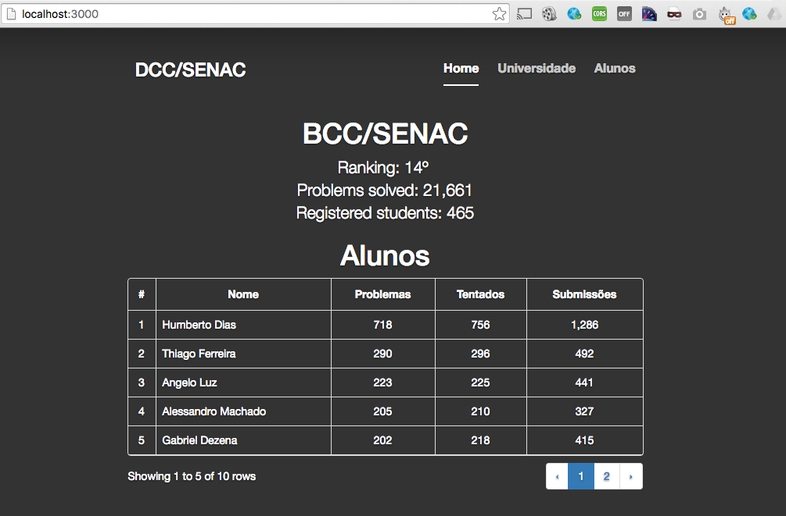

# URI - SENAC

API created for tracking university participation in URI Judge 

## Functionalities

Ranking of SENAC members and your respective quantities of problems solved, tries and submissions.

General ranking of University on the URI site.


## Prerequisites

1. Node 4+
2. npm
3. git


## How to

Clone

```
git clone https://github.com/humbertodias/node-api-uri-judge.git
```

Into

```
cd node-api-uri-judge
```

Deps

```
npm install
```

Run

```
node server.js
```

## Output


